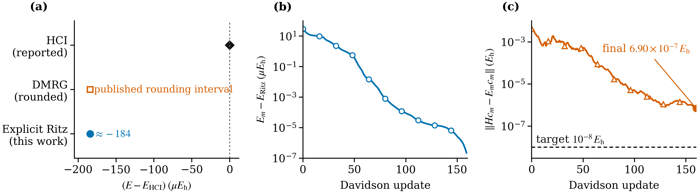
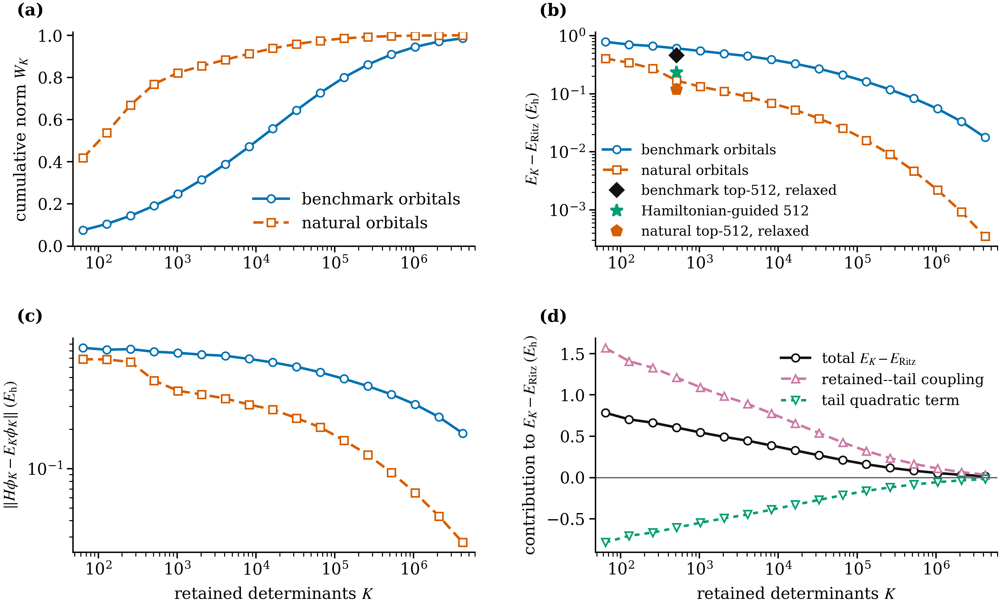

# [2Fe--2S] Davidson Ritz variational study

This repository contains the paper, Supplemental Material, compact numerical
results, figures, and executable analysis for a CAS(30e,20o) [2Fe--2S]
Hamiltonian. Numerical calculations and document builds were run on Bohrium.

## Main results

- A normalized full-space CI Ritz vector gives
  `E = -116.60560912042631 Eh` with residual
  `||Hc-Ec|| = 6.9016e-7 Eh`.
- This upper bound is `184.12 microEh` below the HCI submission in
  [Quantum Advantage Tracker #187](https://github.com/quantum-advantage-tracker/quantum-advantage-tracker.github.io/issues/187).
- It agrees with the published DMRG value `-116.6056091 Eh`
  ([Li and Chan, 2017](https://doi.org/10.1021/acs.jctc.7b00270)); it is not a
  new literature minimum.
- Natural orbitals increase the norm retained by the largest 512 determinants
  from `0.191` to `0.769`, but the corresponding inherited-coefficient state
  remains `168.98 mEh` above the full Ritz energy. Determinant weight alone
  therefore does not certify energy accuracy.
- The Davidson solver stopped at its update limit with `converged=false`; the
  reported number is an explicit variational upper bound, not a certified
  exact ground-state energy.



Figure 1 compares the energy with HCI and rounded DMRG values and shows the
production-stage energy and residual trajectories.



Figure 2 compares determinant weight, energy error, and residuals in the
benchmark and natural-orbital representations.

## Method and provenance

The calculation starts only from the public FCIDUMP and PySCF 2.14's
deterministic two-entry CI guess: `c[0,0]=1.00001` and
`c[15503,15503]=-1e-5`. Matrix-free, diagonally preconditioned Davidson
iterations apply the full Slater--Condon Hamiltonian in the
`(N_alpha,N_beta)=(15,15)` sector. The staged update schedule is
`110/2/16/160`, with explicit hash-identified vectors passed between stages.
Every reported endpoint is checked by a fresh Hamiltonian contraction; no HCI
or DMRG wavefunction is used for initialization.

## Scientific objects

- Hamiltonian: `2fe_2s_30e_20o.fcidump`, SHA-256
  `bd6ef31773f7b082171f73faa6c98924948e2c250b6fbec74504d64361c8c6c7`.
- Hamiltonian source:
  <https://raw.githubusercontent.com/quantum-advantage-tracker/quantum-advantage-tracker.github.io/main/data/variational-problems/hamiltonians/2fe_2s/2fe_2s_30e_20o.fcidump>.
- QMB orbital-equivalence input: repository revision
  `ab1a7002ccbaca0ac43acafaf0f40400d14c3940`, uncompressed SHA-256
  `95d8786af06eeea2107e19ffd98c66a6ca97fc8c9864175a4f6d64512b6f2df9`:
  <https://huggingface.co/datasets/USTC-KnowledgeComputingLab/qmb-models/blob/ab1a7002ccbaca0ac43acafaf0f40400d14c3940/Fe2S2_30_40.FCIDUMP.gz>.
- Final Ritz vector: `fci_ritz_vector.npy`, shape `15504 x 15504`, little-endian
  float64, 1,922,992,256 bytes, SHA-256
  `45e63bb63cd10e953260b6f5dabb8a1dda5518fbf5959002c23888dacb599945`.
- Natural-basis Ritz vector: same shape/dtype/size, SHA-256
  `3855dcb7ce8c44b0f6d9c99fc5787aa2db339002b4d50ec2af8a814c45372d77`.

The large vectors are not duplicated in this compact tree. A public accession
must be inserted before external submission; the hashes above are the identity
gates for a separately transferred copy.

## Documents

- [`2fe2s-variational-study.pdf`](2fe2s-variational-study.pdf): main paper.
- [`2fe2s-variational-study-supplement.pdf`](2fe2s-variational-study-supplement.pdf):
  Supplemental Material.
- [`2fe2s-variational-study-complete.pdf`](2fe2s-variational-study-complete.pdf):
  combined paper and supplement.
- `main.tex`: paper source.
- `supplement.tex`: equations, complete simulation protocol, numerical checks,
  and script-to-result map.
- `results.tex`: macros generated only from frozen numerical outputs.
- `reviews/`: same-referee reports and revision records.
- `variational-benchmark-issue-draft.md`: Quantum Advantage Tracker submission
  text for [issue #238](https://github.com/quantum-advantage-tracker/quantum-advantage-tracker.github.io/issues/238).

## Exact staged Davidson calculation

Use a clean directory with at least 512 GiB RAM and the versions pinned in
`environment/compute-requirements.txt`. Let `FCIDUMP` denote the primary input.
All stages receive an explicit vector; no solver-log energy is used as a result.

```bash
export OMP_NUM_THREADS=64 MKL_NUM_THREADS=64 OPENBLAS_NUM_THREADS=64
export NUMEXPR_NUM_THREADS=64 PYSCF_MAX_MEMORY=450000

FCI_MAX_CYCLE=110 FCI_MAX_SPACE=14 \
  python code/initialize_fci_ritz.py "$FCIDUMP" work/A

FCI_MAX_CYCLE=2 FCI_MAX_SPACE=64 FCI_ENERGY_TOL=1e-13 \
FCI_RESIDUAL_TOL=1e-8 FCI_CHECKPOINT_EVERY=1 \
  python code/continue_fci_checkpointed.py "$FCIDUMP" \
  work/A/fci_ritz_vector.npy work/B1

FCI_MAX_CYCLE=16 FCI_MAX_SPACE=64 FCI_ENERGY_TOL=1e-13 \
FCI_RESIDUAL_TOL=1e-8 FCI_CHECKPOINT_EVERY=8 \
  python code/continue_fci_checkpointed.py "$FCIDUMP" \
  work/B1/fci_ritz_vector.npy work/B2

test "$(sha256sum work/B2/latest_checkpoint.npy | awk '{print $1}')" = \
  1664c06a55c7bc3b814eb18de706eecb4ff5ce0e1c2338282c87bdc76251a213

FCI_MAX_CYCLE=160 FCI_MAX_SPACE=64 FCI_ENERGY_TOL=1e-13 \
FCI_RESIDUAL_TOL=1e-8 FCI_CHECKPOINT_EVERY=8 \
  python code/continue_fci_checkpointed.py "$FCIDUMP" \
  work/B2/latest_checkpoint.npy work/C
```

The expected terminal flag is `solver_converged=false`. The scientific object
is the saved normalized vector and directly contracted Rayleigh quotient
`-116.60560912042631 Eh`; the reported residual is
`6.901557706123275e-7 Eh`.

## Replay and Hamiltonian equivalence

```bash
python code/verify_publication_state.py "$FCIDUMP" \
  work/C/fci_ritz_vector.npy work/publication_state_verification.json

python code/compare_hamiltonian_orbital_equivalence.py \
  "$FCIDUMP" SECOND_FCIDUMP work/hamiltonian_orbital_equivalence.json
```

The first script separately evaluates the direct Hamiltonian action, RDM
energy, residual, norm, and spin. The second recovers the orbital rotation and
compares the complete transformed integral tensors.

## Two-basis top-K experiment

`analysis/analyze_state_compressibility.py` performs exact global amplitude
ranking, explicit renormalization and Hamiltonian contraction for 17 values of
`K`, full residuals, and the shifted retained/tail/cross decomposition. Its
primary-basis run also writes the natural-orbital FCIDUMP and rotation.

```bash
python analysis/analyze_state_compressibility.py "$FCIDUMP" \
  work/C/fci_ritz_vector.npy work/benchmark_basis \
  --basis-label "benchmark-orbital basis" \
  --expected-fcidump-sha256 \
    bd6ef31773f7b082171f73faa6c98924948e2c250b6fbec74504d64361c8c6c7 \
  --expected-vector-sha256 \
    45e63bb63cd10e953260b6f5dabb8a1dda5518fbf5959002c23888dacb599945 \
  --reference-energy-eh -116.60560912042631 \
  --reference-energy-tolerance-eh 2e-10 \
  --max-full-residual-eh 1e-6 \
  --write-natural-orbital-fcidump
```

`analysis/transform_ci_natural_basis.py` then transforms the same full CI tensor
through five-hole complementary minors. Preserve the benchmark run's
`natural_occupations.csv` byte-for-byte as
`natural_occupations_reference.csv`; its required SHA-256 is
`2e9632ff525337eae6329eac5cd5e39b71bd08af85291a335033296b5a732b7d`.
The wrapper `analysis/run_natural_basis_transform.sh` contracts source and
transformed states in one hash-locked process and refuses the natural-basis
top-K analysis unless norm, energy, residual, RDM trace, RDM diagonality, and
the complete RDM comparison with the frozen occupation reference all pass.

```bash
NATURAL_FCIDUMP_SHA256=adb401872023da5b0345ac473a121961d0553f9ddaaa808072423b0a6b24b2aa \
NATURAL_ROTATION_SHA256=3a3dcbdfac4cd66568c66c097fc2ca056a6dbc6027016e0aa63501acf5626532 \
  bash analysis/run_natural_basis_transform.sh
```

The deterministic transformed vector has SHA-256
`3855dcb7ce8c44b0f6d9c99fc5787aa2db339002b4d50ec2af8a814c45372d77`.
`analysis/run_natural_basis_replay_v3.sh` reruns the complete 17-point
natural-basis analysis from that explicit vector and then independently
rediagonalizes its amplitude-ranked top-512 support. Its `2e-8` absolute RDM
trace and elementwise tolerances were frozen after the preliminary numerical
stability diagnostic and before the v3 replay; they must not be adjusted based
on its output. The accepted Bohrium execution completed with exit code 0 and
all frozen checks true. At `K=4,194,304` it gives cumulative norm
`0.9997758503591009`, directly contracted error `0.000348775354297004 Eh`,
and full residual `0.027167832183283697 Eh`. On the unchanged natural-basis
top-512 support, coefficient rediagonalization gives
`-116.48626027879892 Eh`; the explicit reference and PySCF energies differ by
`5.68e-14 Eh`.

The Bohrium payload definitions are `analysis/job-primary-v2.json`,
`analysis/job-natural-basis-transform-v2.json`, and
`analysis/job-natural-basis-replay-v3.json`.

## 512-determinant controls

- `analysis/rediagonalize_topk_support.py` selects the exact amplitude-ranked
  top-512 support of either full representation-specific vector, builds its
  dense Hamiltonian with `analysis/reference_slater_condon.py`, and
  rediagonalizes it. Frozen JSON/CSV outputs are supplied for both the
  benchmark and natural-orbital bases.
- `analysis/guided_512/` contains the candidate-pool and fixed-budget
  Hamiltonian-guided support-search code. The frozen output is
  `data/optimized_512_state.csv`.
- `analysis/validate_optimized_512.py` independently recomputes that frozen
  state with the explicit reference implementation and a PySCF full-space
  embedding.

```bash
bash analysis/run_top512_rediagonalization.sh
bash analysis/run_optimized_512_validation.sh
```

The same-support and guided-support states are stationary only in their listed
512-dimensional subspaces; their full-space residuals remain nonzero. Neither
state is described as a globally optimal support.

## Figures and manuscript build

`data/` contains every compact CSV/JSON consumed by
`figures/build_figures.py`. The figure script performs numerical closure gates
before writing vector PDF/SVG and 450-dpi PNG outputs. Build the figures and TeX
in the pinned Bohrium environment:

```bash
python figures/build_figures.py
latexmk -pdf -interaction=nonstopmode -halt-on-error main.tex
latexmk -pdf -interaction=nonstopmode -halt-on-error supplement.tex
```

No large-vector contraction occurs during figure or manuscript generation.
